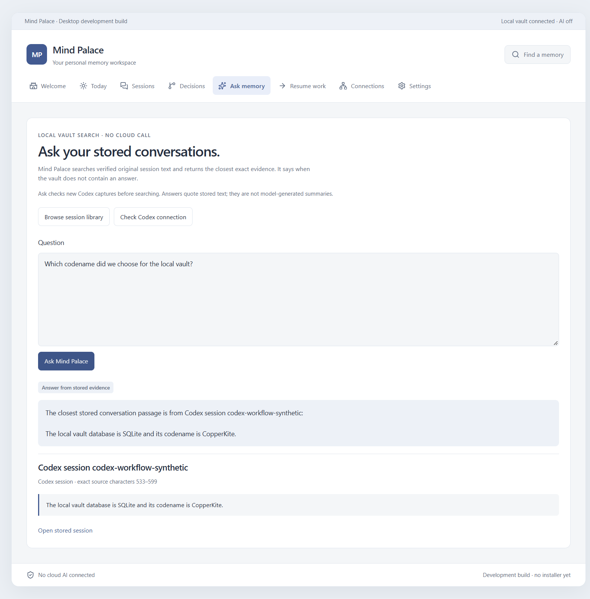
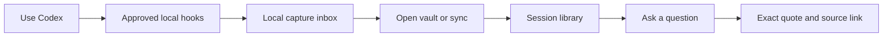
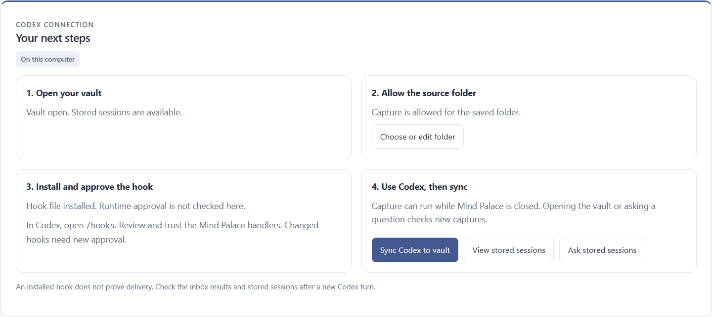

<div align="center">

# Mind Palace

### Your coding conversations. Your local vault. Answers with sources.

Save the work behind your decisions. Find it when you need it.

**Local first** · **Codex integration** · **Original sources** · **No model required for search**

[Get started](docs/user-guide.md) · [See what works](#what-works-today) · [Roadmap](docs/roadmap.md) · [Contribute](CONTRIBUTING.md)

</div>

---

Mind Palace is a desktop memory workspace for coding conversations. Connect Codex, keep session transcripts in a local vault, and ask questions that return exact passages from those sessions.

> **Current stage: Windows desktop development build.** The Codex capture-to-answer workflow has passed native tests with synthetic data. Browser mode offers a fictional sample; it cannot connect your desktop vault.



*An actual native answer with a quote and source link. Screenshots use synthetic conversations and the app's MP lettermark. No private session data is shown.*

## Why use it?

A coding conversation can contain the reason for a database choice, a rejected approach, or the next task. Mind Palace keeps the original record available after the chat ends.

- **Keep the source.** Captured revisions remain immutable; the reader checks original content before showing it.
- **Find the evidence.** Ask searches stored conversation text and returns an exact quote with a source link.
- **Resume with context.** Read your saved session without reopening the original coding client.
- **Stay local.** Capture, storage and source search need no API key or cloud AI call.

## What works today

| Capability | Current behavior |
| --- | --- |
| Codex setup | Guided vault opening, exact folder consent and safe hook installation/removal. |
| Capture while the app is closed | Approved Codex hooks write a local inbox independently of Mind Palace. |
| Import and recovery | Vault open, refresh and Ask check captures. Known sessions can recover a missed tail from the approved folder. |
| Existing history | Review source metadata, then explicitly confirm history import. |
| Session library | Browse saved sessions, filter loaded titles, read messages and inspect the complete source. |
| Ask memory | Local keyword search, exact quoted evidence, source links and abstention when evidence is missing. |
| Manual fallback | Save pasted conversations and manual notes in the local vault. |
| Storage safety | One canonical record per captured session, immutable source revisions, bounded imports and visible failure messages. |
| Inbox controls | Pause capture, inspect health, repair known sessions and clean acknowledged old prefixes. |

**Ask is source search today.** It does not generate model summaries. The banner `Local vault connected · AI off` means storage is open and no AI model is connected. Source search still works.

## The working flow



1. Open the **desktop build**. Create a local vault once, or open your existing vault.
2. In **Connections**, select Codex and enter its exact transcript folder. Allow capture and save the scope.
3. Click **Install Codex hook**. In Codex, use `/hooks` to review and trust the Mind Palace handlers.
4. Use Codex. Capture can continue while Mind Palace is closed.
5. Open the vault or click **Sync Codex to vault**. Read the result in **Sessions**.
6. Open **Ask memory**, use terms from the conversation, and inspect the quoted source.

Changed hook definitions need fresh Codex approval. An installed file does not prove that a hook ran. See the [user guide](docs/user-guide.md) for history import, pause/removal and troubleshooting.

### Setup on your computer



*The actual setup checklist distinguishes an installed hook from runtime approval.*

## Verified results

The latest full native check covered setup, hook merge/removal, closed-app capture, restart import, missed-tail repair, Library filtering, fresh-turn Ask, source opening and explicit history import. A complete **20 MiB** source passed capture/import/read with a matching SHA-256. Latest recorded suites: **35 Angular tests** and **19 Rust tests** passed.

These checks use isolated synthetic data. Installed Codex CLI **0.160.0** also passed normal persisted hook approval in a separate controlled fixture. No paid model generation was used.

Read the evidence: [native workflow](docs/verification/codex-runtime-13.md), [hook trust](docs/verification/codex-trust-11.md), [two-minute test](docs/verification/codex-two-minute-10.md), [current status](docs/implementation-status.md).

## Try the browser sample

Use Node **24.16.0** and npm **11.17.0**, the versions used for the recorded checks.

```sh
npm ci
npm run dev:web
```

Open `http://127.0.0.1:4200` and choose **Explore sample workspace**. The sample resets on reload. It demonstrates the interface; it does not save personal memory or connect Codex.

For the real local workflow, use a prepared Windows desktop build. See [development setup](docs/development.md). Native builds need staged Python bundles, local compiler resources, WebView2 and native icons. Generated native resources are excluded from Git. The development guide explains the required preparation.

## Under the hood

| Layer | Responsibility |
| --- | --- |
| Angular 22 | Setup, session reader and Ask interface. |
| Tauri 2 | Validated native commands, process ownership and desktop boundary. |
| Bundled Python | Capture inbox, immutable source files, vault storage and evidence search. |
| Local hooks | Capture approved client events without running an inference model. |

Sources and model output are data. They cannot grant permissions or execute instructions. Capture uses an approved source scope. Unknown history needs explicit confirmation. No developer analytics or hidden cloud sharing is enabled.

## Build with us

Start with the [contribution guide](CONTRIBUTING.md). Reliability, synthetic fixtures, accessibility, source-backed documentation and packaging reproducibility are useful contribution areas.

[User guide](docs/user-guide.md) · [Development](docs/development.md) · [Roadmap](docs/roadmap.md) · [Architecture and plan](docs/implementation-plan.md) · [Decisions](docs/decisions.md)

Code is [MIT licensed](LICENSE). Public screenshots use the app's existing MP lettermark. See [asset provenance](design/brand/README.md) for artwork details.
